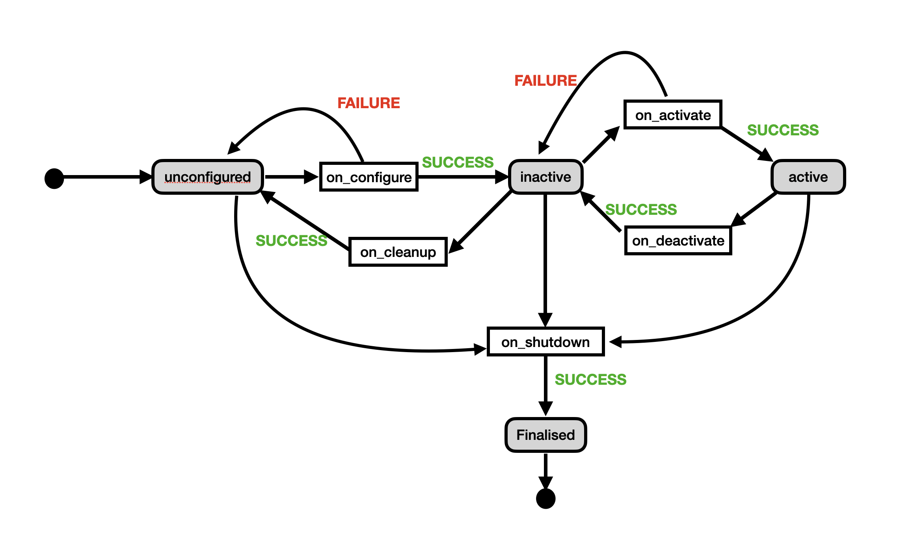
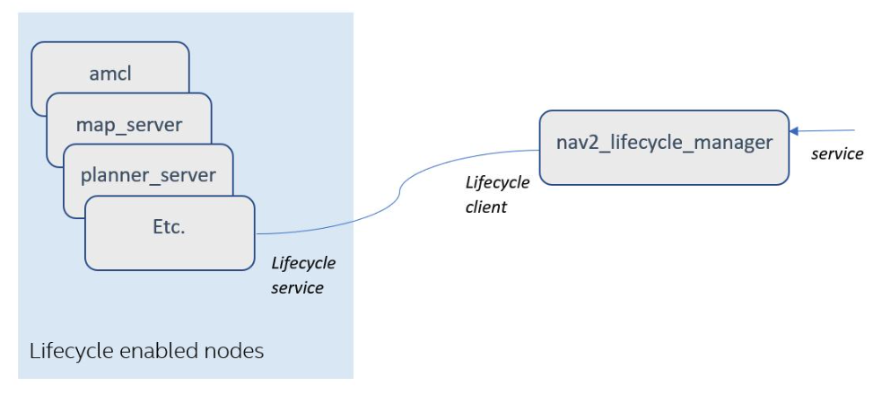
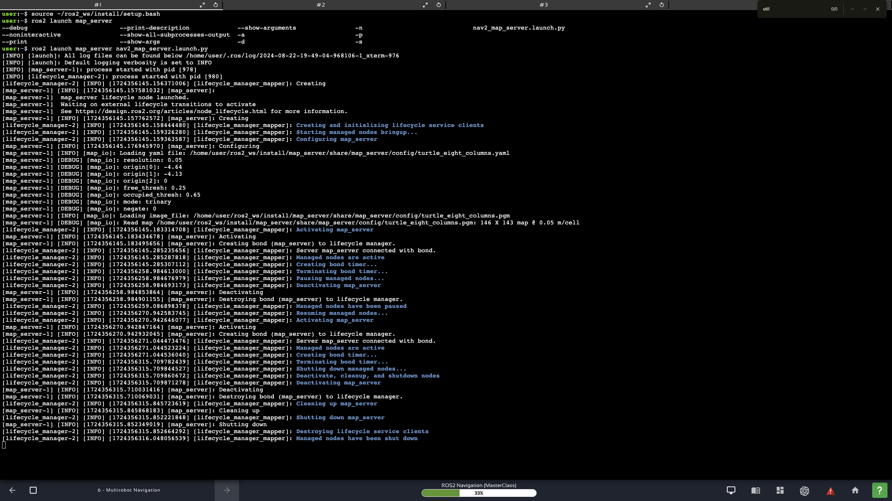

### `map_server`

#### Notes
1. The instructions for `map_server` showed `History Policy = Keep Last` for the `Map` topic `/map`, but the config file for [`cartographer_slam`](https://github.com/ivogeorg/cartographer_slam.git) works fine, and there `History Policy = Keep All`.
2. The `map_server` package [launches]() a `nav2_lifecycle_manager` node. Lifecycle nodes are [nodes with managed lifecycle](https://design.ros2.org/articles/node_lifecycle.html).
     

#### Nav2

##### 1. ROS2

1. Node `lifecycle_manager_mapper`
2. Message `bond/msg/Status`
3. Message `nav2_msgs/srv/ManageLifecycleNodes`  
4. Services of `lifecycle_manage_mapper`

```
user:~$ ros2 node info /lifecycle_manager_mapper
/lifecycle_manager_mapper
  Subscribers:    /bond: bond/msg/Status
    /clock: rosgraph_msgs/msg/Clock    /parameter_events: rcl_interfaces/msg/ParameterEvent
  Publishers:
    /bond: bond/msg/Status
    /parameter_events: rcl_interfaces/msg/ParameterEvent
    /rosout: rcl_interfaces/msg/Log
  Service Servers:
    /lifecycle_manager_mapper/describe_parameters: rcl_interfaces/srv/DescribeParameters
    /lifecycle_manager_mapper/get_parameter_types: rcl_interfaces/srv/GetParameterTypes
    /lifecycle_manager_mapper/get_parameters: rcl_interfaces/srv/GetParameters
    /lifecycle_manager_mapper/is_active: std_srvs/srv/Trigger
    /lifecycle_manager_mapper/list_parameters: rcl_interfaces/srv/ListParameters
    /lifecycle_manager_mapper/manage_nodes: nav2_msgs/srv/ManageLifecycleNodes
    /lifecycle_manager_mapper/set_parameters: rcl_interfaces/srv/SetParameters
    /lifecycle_manager_mapper/set_parameters_atomically: rcl_interfaces/srv/SetParametersAtomically
  Service Clients:
    /map_server/change_state: lifecycle_msgs/srv/ChangeState
    /map_server/get_state: lifecycle_msgs/srv/GetState
  Action Servers:

  Action Clients:

user:~$ ros2 interface show bond/msg/Status
std_msgs/Header header
        builtin_interfaces/Time stamp
                int32 sec
                uint32 nanosec
        string frame_id
string id  # ID of the bond
string instance_id  # Unique ID for an individual in a bond
bool active

# Including the timeouts for the bond makes it easier to debug mis-matches
# between the two sides.
float32 heartbeat_timeout
float32 heartbeat_period
user:~$ ros2 interface show nav2_msgs/srv/ManageLifecycleNodes
uint8 STARTUP = 0
uint8 PAUSE = 1
uint8 RESUME = 2
uint8 RESET = 3
uint8 SHUTDOWN = 4

uint8 command
---
bool success
user:~$ ros2 service list | grep lifecycle
/lifecycle_manager_mapper/describe_parameters
/lifecycle_manager_mapper/get_parameter_types
/lifecycle_manager_mapper/get_parameters
/lifecycle_manager_mapper/is_active
/lifecycle_manager_mapper/list_parameters
/lifecycle_manager_mapper/manage_nodes
/lifecycle_manager_mapper/set_parameters
/lifecycle_manager_mapper/set_parameters_atomically
user:~$
```

##### 2. Managed nodes

1. Managed nodes in Nav2 (also `controller_manager`)
   1. Diagram
        
   2. Launch needs an _ordered_ list of nodes to manage
      ```
      Node(
          package='nav2_lifecycle_manager',
          executable='lifecycle_manager',
          name='lifecycle_manager',
          output='screen',
          parameters=[{'autostart': True},
                      {'node_names': ['map_server',
                                      'amcl',
                                      'controller_server',
                                      'planner_server',
                                      'recoveries_server',
                                      'bt_navigator']}])
      ```
   3. Managed nodes derive from `LifecycleNode` and Nav2 shadows is under the same name provided by `nav2_util`.
   4. Calling the `manage_nodes` service with a state code:
      ```
      ros2 service call /lifecycle_manager_mapper/manage_nodes nav2_msgs/srv/ManageLifecycleNodes command:\ 1\
      ```
   5. Lifecycle manager log:
        
2. The Nav2 bond between lifecycle manager and lifecycle (aka managed) nodes. Here's what Gemini had to say about it:

> In the context of the ROS 2 Nav2 lifecycle manager, "bond" refers to a connection or relationship established between the lifecycle manager and the lifecycle nodes it manages. This connection is crucial for ensuring the stability and reliability of the Nav2 system.   
> 
> Key Purposes of Bond in Nav2 Lifecycle Manager:
> 
> Node Monitoring: The bond acts as a heartbeat mechanism, allowing the lifecycle manager to continuously monitor the health and availability of the lifecycle nodes.   
> 
> Fault Detection: If a lifecycle node becomes unresponsive or crashes, the bond connection is broken. The lifecycle manager detects this and can take appropriate actions, such as transitioning other nodes to a safe state or attempting to restart the failed node.   
> 
> Graceful Shutdown: When shutting down the Nav2 system, the lifecycle manager uses the bond connections to ensure that all lifecycle nodes are properly transitioned to the finalized state before terminating.
> 
> How Bond Works:
> 
> The Nav2 lifecycle manager creates bond connections with each lifecycle node it manages.   
> These bond connections involve periodic heartbeat messages exchanged between the manager and the nodes.
> The manager monitors the heartbeats and considers a node "alive" as long as it receives regular heartbeats.
> If a node's heartbeat stops, the manager detects the broken bond and initiates appropriate recovery actions.
> Benefits of Bond:
> 
> Improved Robustness: Bond helps prevent cascading failures in the Nav2 system by quickly detecting and responding to node failures.
> Graceful Shutdown: It ensures a controlled and orderly shutdown of the Nav2 system, minimizing the risk of data loss or unexpected behavior.
> User Configurability: You can configure the bond timeout parameters (e.g., heartbeat frequency, allowed missed heartbeats) to fine-tune the fault detection sensitivity.
> Example (Configuring Bond Timeout in Nav2 Lifecycle Manager):

> ```
> YAML
> lifecycle_manager:
>   ros__parameters:
>     bond_timeout: 5.0  # Timeout in seconds
> ```

> Key Takeaways:
> 
> Bond is a critical component of the Nav2 lifecycle manager that enhances the robustness and reliability of the Nav2 system.
> It enables the manager to monitor the health of lifecycle nodes, detect failures, and initiate graceful shutdown procedures.   
> Understanding and configuring bond parameters is essential for achieving a stable and fault-tolerant Nav2 system.

